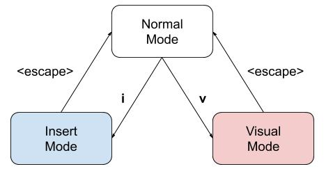
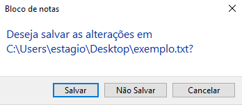

# Start
A melhor maneira de memorizar um atalho/comando é relacionando ele com a ação que você quer executar.  
Por exemplo, é fácil lembrar que `d` é apagar pois a letra d vem de **D**elete.  

Usarei português e inglês quando julgar apropriado (quando eu quiser).  

É bom ter um conhecimento de programação para usar Vim. Por exemplo, sabe que "salvar" o arquivo é nada mais que "escrever em cima do anterior".  

## Instructions
* Eu vou referênciar a teclas utilizando o formato de "uma linha de código" do Markdown.  
  * tecla `y`, tecla `p`, tecla `d`, tecla `;`...  
* Vim é sensível a caracter, ou seja, apertar `d` é diferente de apertar `D` (shift + d)  
  * tecla `Y`, tecla `P`, tecla `D`, tecla `:`...  
* Se a tecla não for uma letra apenas, vou escrever o nome da tecla entre "<" e ">".  
  * tecla `<up>`, tecla `<down>`, tecla `<esc>`...  
* Apertar uma combinação de teclas ao mesmo tempo vai ser representado com um sinal de + fora da formatação de tecla.  
  * teclas `<ctrl>` + `w`...  
* Apertar uma sequência de teclas vai ser representado em apenas uma formatação.  
  * apertar teclas `ydp` (`y`,`d`,`p`), apertar teclas `:q!<enter>` (`:`,`q`,`!`,`<enter>`)...  
* Qualquer outro caso eu tentarei deixar claro o que você deve apertar.  

# Modes
Vim é dividido em 3 modos, cada um com funcionalidades diferente. As funcionalidades das suas teclas variam em cada modo.  

É por isso que pessoas novas ficam perdidas no vim. Elas começam a tentar escrever texto sem antes entrarem no modo que permite escrever.  

| Modo            | Utilidade         |                  | Atalho |
| --------------- | ----------------- | ---------------- | ------ |
| Normal Mode     | Executar comandos | **default mode** |        |
| **I**nsert Mode | Inserir texto     |                  | `i`    |
| **V**isual Mode | Selecionar texto  |                  | `v`    |

  

Se você está no Normal Mode, você pode ir para o **I**nsert Mode apertando a tecla `i`.  
Se você está no Normal Mode, você pode ir para o **V**isual Mode apertando a tecla `v`.  
Se você está no Insert Mode ou Visual Mode, você pode voltar para o Normal Mode apertando a tecla `<esc>`.  

# Insert Mode
No início esse vai ser o seu modo mais utilizado pois ele te lembra de como qualquer editor normal funciona, ou seja, você aperta uma tecla e ela é escrita na tela.  

## Shift
Se você está acostumado a selecionar parte do texto utilizando a tecla `<shift>`, você deve notar rápido que não é possvel selecionar parte do texto nesse modo, para selecionar texto é preciso ir para o modo Visual Mode.  

> Shift funciona de maneira engraçada pois dependendo da tecla com qual você utilizar, você vai reproduzir exatamente a mesma coisa que outro atalho faria...  

| Atalho                | Ação                                    | Atalho similar       |
| --------------------- | --------------------------------------- | -------------------- |
| `<shift>` + `<right>` | mover para o início da palavra seguinte | `<ctrl>` + `<right>` |
| `<shift>` + `<left>`  | mover para o início da palavra anterior | `<ctrl>` + `<left>`  |

# Visual Mode

# Normal Mode
As teclas normais são guardadas para comandos muito utilizados durante o Vim, sair do Vim não é um deles :poop:  

## Quit
`:quit` encerra o Vim.  

Editores normais detectam se você fez alteração no texto antes de você encerrar eles, caso tenha feito uma janela aparece perguntando se deve salvar, ignorar ou cancelar.  
  

Vim também detecta se você alterou o texto antes de encerra-lo, mas diferente dos outros editores ele não exibe uma janela perguntando a você o que deve fazer, ele toma o caminho mais seguro que é **cancelar**.  

Se você fez alterações e você não liga de encerrar sem salvar, tudo que você precisa fazer é forçar o comando quit.  
`:quit!` encerra independente se houver alterações no arquivo.  

Não é muito difícil lembrar que forçar um comando é botar um ponto de exclamação nele, basicamente você está gritando com ele para ele executar. :rage: Just do it!  

| Comando  | Ação                 | Sinônimo |
| -------- | -------------------- | -------- |
| `:quit`  | Tenta encerrar       | `:q`     |
| `:quit!` | Força o encerramento | `:q!`    |

## Write
