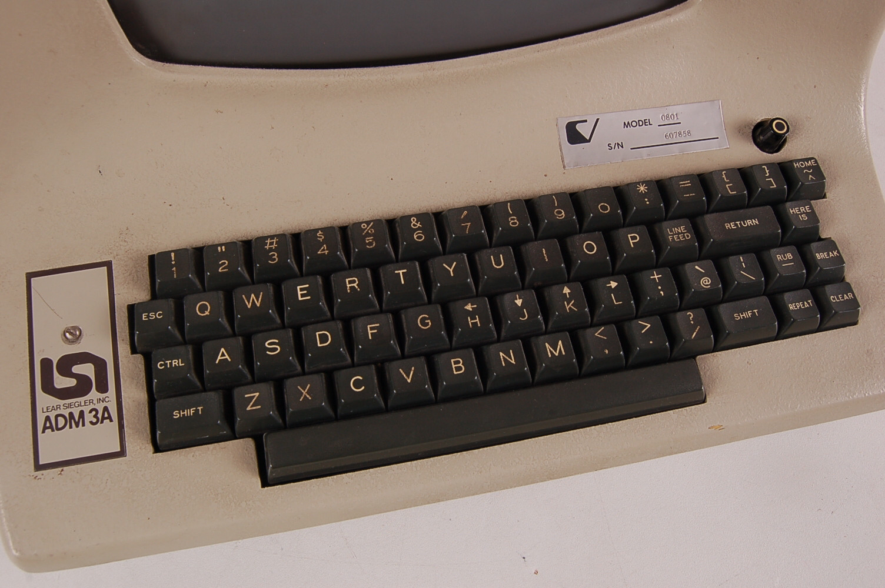
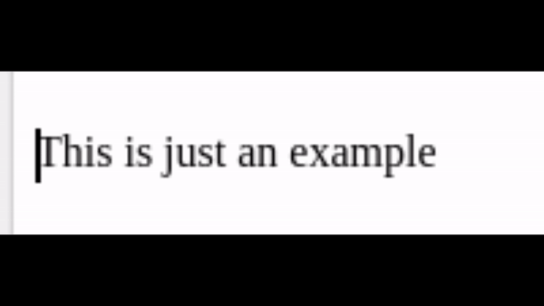

# Normal Mode
As teclas normais são guardadas para comandos muito utilizados durante o Vim (sair do Vim não é um deles :poop:)  

> Não se esqueça que Vim é sensível a caracter, `K` é diferente de `k`

## Move up, down, left and right
Mover se pelo editor de texto é essencial para o dia-a-dia e muitas vezes utilizamos o mouse para selecionar onde queremos ir do texto. Porém Vim não conta com suporte para mouse para suas tarefas, isto ocorre pelo design original do teclado da época:  

  

Por isto muitos dos atalhos são teclas que hoje em dia é considerado estranho. Observe que o teclado não possuía teclas como `<right>`, `<up>`, `<left>`, `<down>`, `<end>`, `<pg up>` e `<pg down>`...  

| Atalho | Ação                      | Dica                                                   | Atalho 2  |
| ------ | ------------------------- | ------------------------------------------------------ | --------- |
| `h`    | Mover para esquerda       | A tecla mais na **esquerda**, move para a **esquerda** | `<left>`  |
| `j`    | Mover para baixo          |                                                        | `<down>`  |
| `k`    | Mover para cima           |                                                        | `<up>`    |
| `l`    | Mover para direita        | A tecla mais na **direita**, move para a **direita**   | `<right>` |

E é por isto também que muitas vezes você vai encontrar atalhos atuais fazendo a mesma coisa que atalhos antigos do Vim.  

## Move word

| Atalho  | Ação                                      | Dica     | Atalho 2              |
| ------- | ----------------------------------------- | -------- | --------------------- |
| `w`     | Mover para o início da "palavra" seguinte | **w**ord | `<shift>` + `<right>` | 
| `b`     | Mover para o início da "palavra" anterior | **b**ack | `<shift>` + `<left>`  |
| `W`     | Mover para o início da palavra seguinte   | **W**ORD | `<ctrl>` + `<right>`  |
| `B`     | Mover para o início da palavra anterior   | **B**ACK | `<ctrl>` + `<left>`   |

**"palavra"**: Qualquer sequência de letras ou qualquer sequência de não-letras (menos espaço).  
**palavra**: Qualquer sequência de caracteres (menos espaço).  

## Move page up or down

| Atalho         | Ação                         | Dica        | Atalho 2    |
| -------------- | ---------------------------- | ----------- | ----------- |
| `<ctrl>` + `f` | Mover uma página para baixo  | **f**orward | `<pg down>` |
| `<ctrl>` + `b` | Mover uma página para cima   | **b**ack    | `<pg up>`   |
| `<ctrl>` + `d` | Mover meia página para baixo | **d**own    |             |
| `<ctrl>` + `u` | Mover meia página para cima  | **u**p      |             |

## Move start/end of line

| Atalho | Ação                                               | Atalho 2 | Atalho 3    |
| ------ | -------------------------------------------------- | -------- | ----------- |
| `0`    | Mover para o início da linha                       | `\|`     | `<home>`    |
| `$`    | Mover para o final da linha                        |          | `<end>`     |
| `^`    | Mover para o primeiro caracter não-branco da linha | `_`      |             |

> Barra em pé, início da linha  
> Barra deitada, início após pular todo caracter branco  
  

## Move across the screen

| Atalho | Ação                          | Dica       |
| ------ | ----------------------------- | ---------- |
| `H`    | Mover para o topo da tela     | **H**igh   |
| `M`    | Mover para o meio da tela     | **M**iddle |
| `L`    | Mover para o inferior da tela | **L**ow    |

## Move to line

| Atalho  | Ação                       | Dica                | Atalho 2            |
| ------- | -------------------------- | ------------------- | ------------------- |
| `1G`    | Mover para primeira linha  | Line **1**, **G**o  | `<ctrl>` + `<home>` |
| `20G`   | Mover para linha 20        | Line **20**, **G**o |                     |
| `G`     | Mover para última linha    | **G**o              | `<ctrl>` + `<end>`  |

Mover para uma linha especifica pode ser um tanto quanto difícil se você não botar para as linhas aparecerem. Utilizando `:set number` as linhas iram aparecer enquanto você não fechar o Vim.

> Ficar digitando esse comando o tempo todo pode ser chato então próximo capitulo iremos alterar as configurações do Vim

# Visual Mode
Muitas vezes os comandos neste modo se aproveitam dos comandos do **Normal Mode**. Por exemplo, ao entrar neste modo você continua a poder usar dos atalhos normais de movimentação para ajuda-lo a selecionar o texto.  
